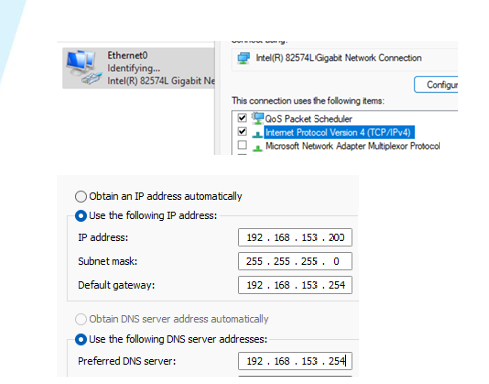
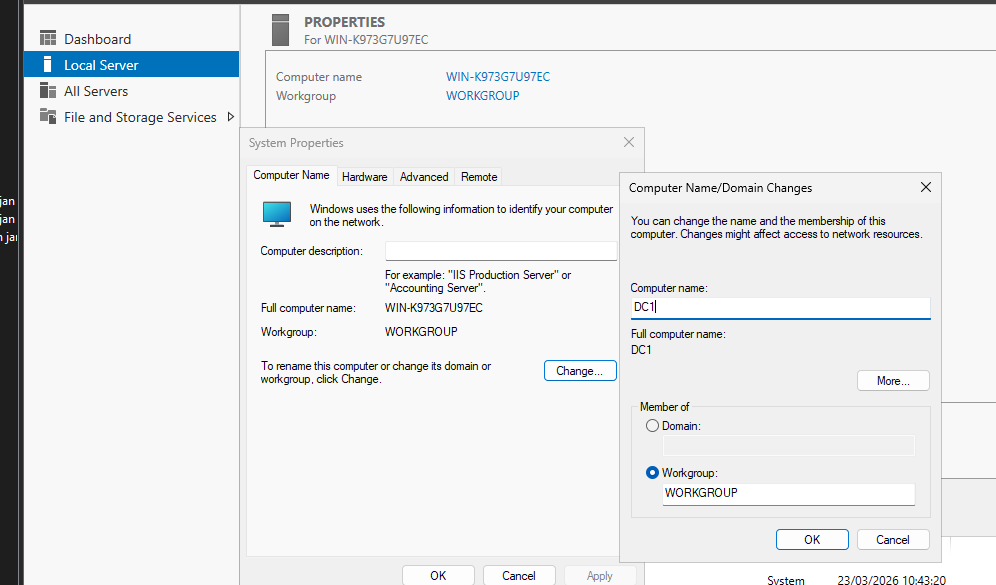
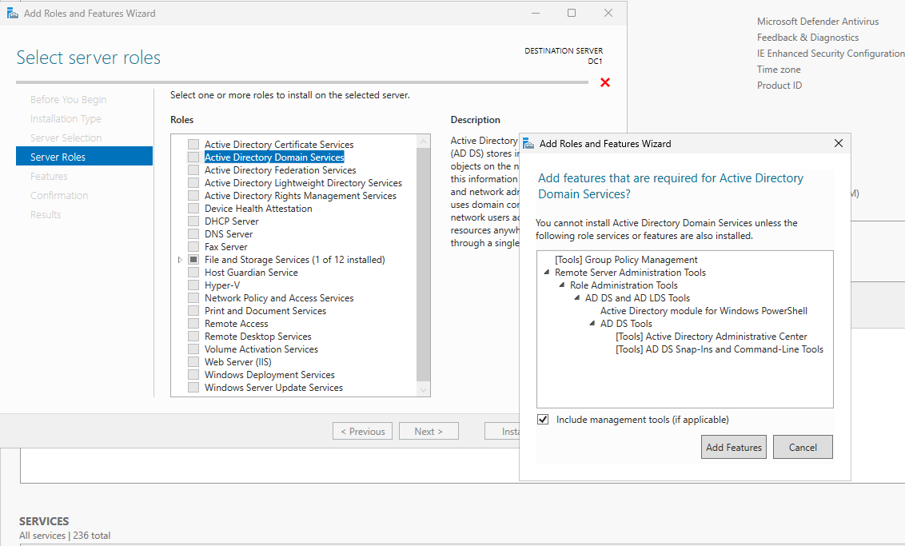
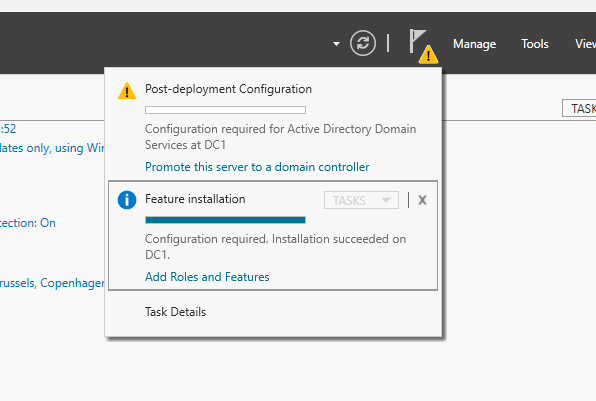
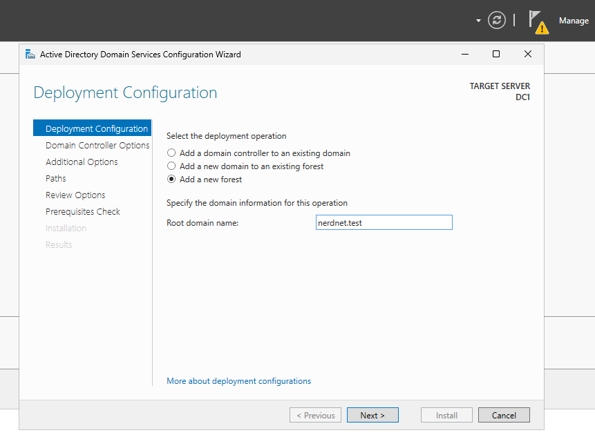
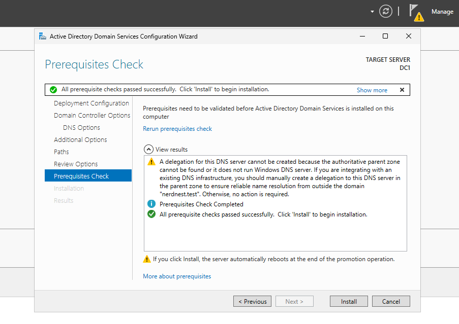

## network setup 

PRETEXT : 

First, we start with the pfSense download it, import it in VMware and do the setup. 
The setup means mostly sysprepping it for future projects.  

The lab environment uses a host-only network in VMware.　－－＞ very controlled and only connected through PFsense

DHCP is disabled in this environment.  
Therefore, all devices must be configured manually with a static IP address.

LAN subnet: ( this IP address has been given by the educator)

192.168.153.0/24

This means all machines must use an IP address within the range:

192.168.153.1 – 192.168.153.254

START PROJECT :

### Device addressing

The following addressing scheme is used:

- pfSense (gateway): 192.168.153.1
- Windows Server: 192.168.153.220 
- Windows Client: 192.168.153.10

Servers will have higher IP starting from 200+ and clients 10+ range to keep things simple. 

### NETWORKING tasks

windows-run --> ncpa.cpl --> Ethernet0 --> properties --> (TCP/IPv4)

In the IPv4 settings, configure a static IP address for the server:

- IP address: 192.168.153.220
- Subnet mask: 255.255.255.0
- Default gateway: 192.168.153.1
- Preferred DNS server: 192.168.153.1

This ensures the server has a fixed address within the network, which is required for services like Active Directory and DNS.
A static IP address is required for the server to ensure it remains consistently reachable within the network. This is essential for services like Active Directory and DNS, which rely on a fixed address to function correctly.

## post-deployment, name and date config

First, we give the server a simple hostname because if you are going to make changes and have to reuse the name a lot, it helps. 
Once you have promoted the server, you cannot change the name unless you demote the domain controller. 

- changing the name: Local Server --> Computer name --> change
  

- correct time zone: Local Server --> Time Zone --> Change time zone...
- Keep up to date : ( same as normal Windows)

## Domain
  
To promote the server to a Domain Controller:  

- Manage --> add roles and features

There is also the option to make the DC a DNS server; DNS is essential because Active Directory relies on DNS for service location (SRV records) and not just authority over namespace. 
Even if you don't manually select this in the Add Roles and Features step, it gets done automatically because of this.  

next ... --> install; installing is not enough to transform the standalone server into a domain controller. 
Before than configuration settings need to be done correctly.   

We are promoting a standalone server to a DC. 
Because of that, we are creating a new forest (and its first domain).

Follow the best practices until the check, where you might encounter an error, like in the example below : 

