## network setup 

PRETEXT : 

First, we start with the pfSense download it, import it in VMware and do the setup. 
The setup means mostly sysprepping it for future projects.  

The lab environment uses a host-only network in VMware.　－－＞ very controlled and only connected through PFsense

DHCP is disabled in this environment.  
Therefore, all devices must be configured manually with a static IP address.

LAN subnet: ( this IP address has been given by the educator)

192.168.153.0/24

This means all machines must use an IP address within the range:

192.168.153.1 – 192.168.153.254

START PROJECT :

### Device addressing

The following addressing scheme is used:

- pfSense (gateway): 192.168.153.1
- Windows Server: 192.168.153.220 
- Windows Client: 192.168.153.10

Servers will have higher IP starting from 200+ and clients 10+ range to keep things simple. 

### NETWORKING tasks

windows-run --> ncpa.cpl --> Ethernet0 --> properties --> (TCP/IPv4)

In the IPv4 settings, configure a static IP address for the server:

- IP address: 192.168.153.220
- Subnet mask: 255.255.255.0
- Default gateway: 192.168.153.1
- Preferred DNS server: 192.168.153.1

This ensures the server has a fixed address within the network, which is required for services like Active Directory and DNS.
A static IP address is required for the server to ensure it remains consistently reachable within the network. This is essential for services like Active Directory and DNS, which rely on a fixed address to function correctly.

## post-deployment, name and date config

First, we give the server a simple hostname because if you are going to make changes and have to reuse the name a lot, it helps. 
Once you have promoted the server, you cannot change the name unless you demote the domain controller. 

- changing the name: Local Server --> Computer name --> change
  

- correct time zone: Local Server --> Time Zone --> Change time zone...
- Keep up to date : ( same as normal Windows)

## Domain
  
To promote the server to a Domain Controller:  

- Manage --> add roles and features

There is also the option to make the DC a DNS server; DNS is essential because Active Directory relies on DNS for service location (SRV records) and not just authority over namespace. 
Even if you don't manually select this in the Add Roles and Features step, it gets done automatically because of this.  

next ... --> install; installing is not enough to transform the standalone server into a domain controller. 
Before than configuration settings need to be done correctly.   

We are promoting a standalone server to a DC. 
Because of that, we are creating a new forest (and its first domain).

Follow the best practices until the check, where you might encounter an error, like in the example below : 

.test isn't used on the internet, which might cause issues, but we use it because this is a lab, and to avoid issues. 
So this domain can't be accessed from the outside, which was the point of a lab. 

## Users 
below are 2 methods to get to Active Directory Users and Computers where you can creat new users or add them to groups etc ... 

1) tools --> active Directory Users and Computers
2) Run: dsa.msc

Note: On a Domain Controller, local user management is replaced by Active Directory. 

Default admin needs to have a very strong password and it is not best practices to use it for daily tasks so we will : 
- Upgrade password of admin 
- a new admin for daily use
- default user with minimum access 

First, let's upgrade the password: on Administrator --> RMK (right mouse click) --> Reset Password 

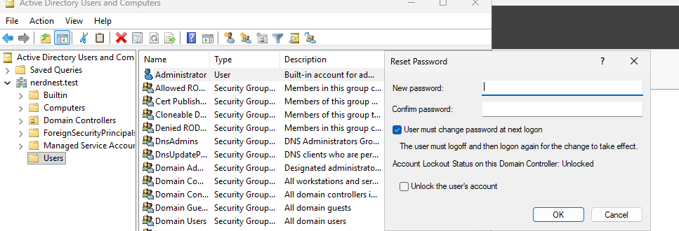

Next look into making new accounts : 

RMK (right mouse click) --> New -->  User --> next ...

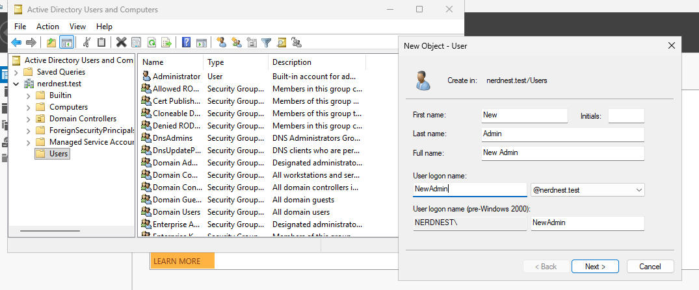

The final step is to put the New Admin into the administrator group : 

RMK (right mouse click) on the account --> Properties --> Member Of --> Add... --> check name to make sure it is correct --> OK --> apply 

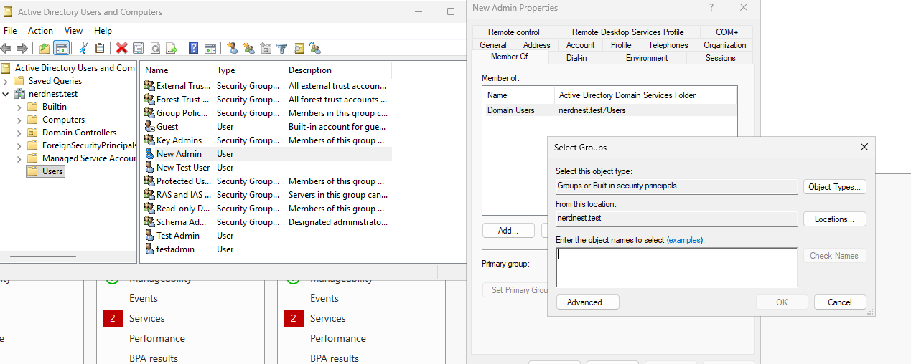

## DNS

Up next, we will implement basic company policy, which is to use a DNS server to block damaging content and unwelcome websites. 
For this purpose we will be using family shield. 

First, we find the addresses to use the DNS of Family Shield. 

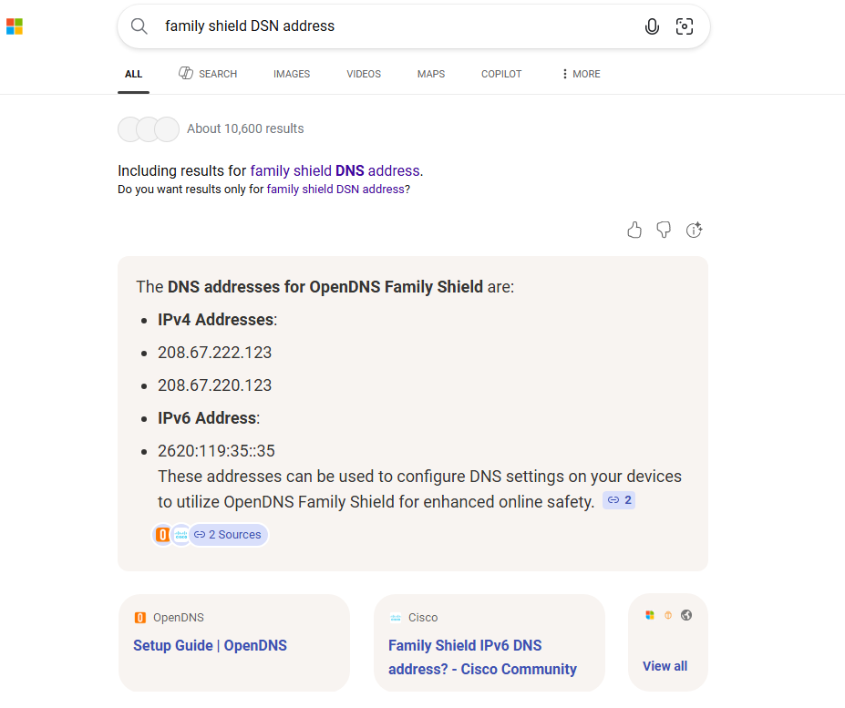 

Then : Tools --> DNS --> RMK (Right Mouse Klick) on DC1 --> properties 

There is a DNS of the PFsense mentioned earlier, which we will delete. 
Because even if it is the lowest position and priority in case the family shield DNS fails, the connection will happen with the PFsense, and the restriction will be bypassed. 

In properties: edit --> delete PFsense IP then add the IP of Family Shield 

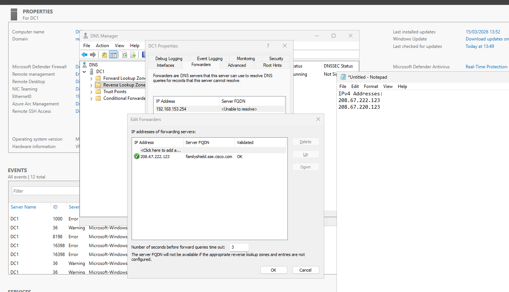

To test if our setup is correct, we will ping the Google DNS servers (8.8.8.8 and 8.8.4.4). 

Tools --> DNS --> New Host ( A or AAAA) ... --> Add Host and remove the PTR record because it is used for reverse DNS (IP--> name). 

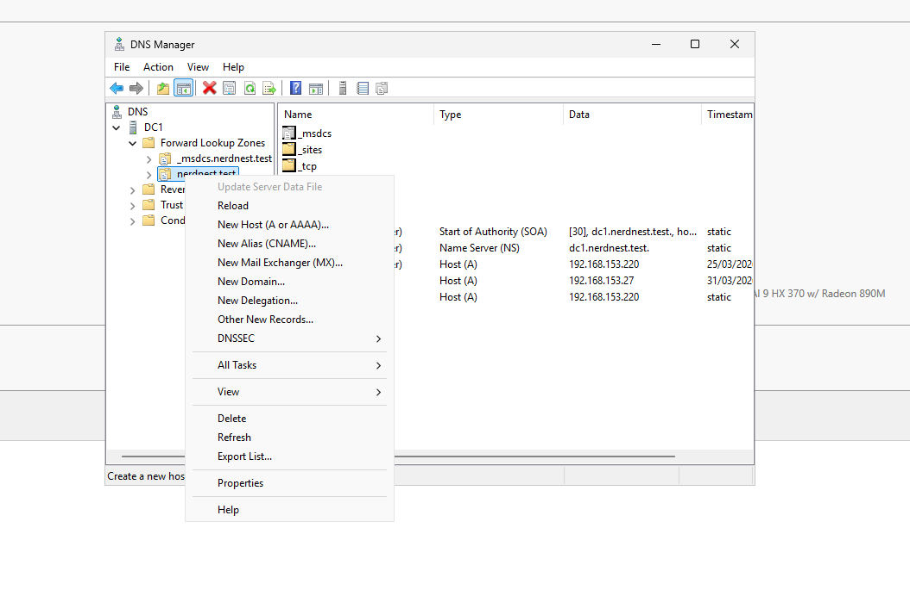

Repeat for both 

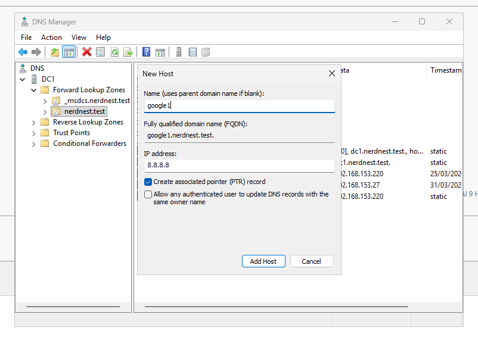

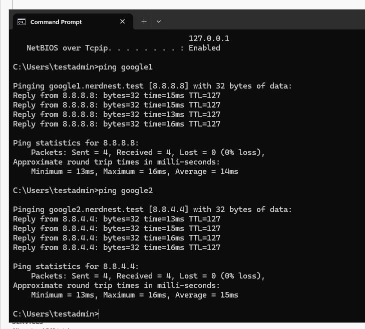

We created an A record (name → IP) and use ping to verify that the DNS server correctly resolves the name to the IP address.

## Client in Domain 

Before adding the client computer to the domain, we have to do some prep work. 
First of all because we are working with a pfsense we have to just like before with the DNS make sure that it is not on default but configure to be able to connect with the domain. 
So we change the DHCP to the domain IP because the pfsense acts like a router here and we want to route the client to the IP of the server.

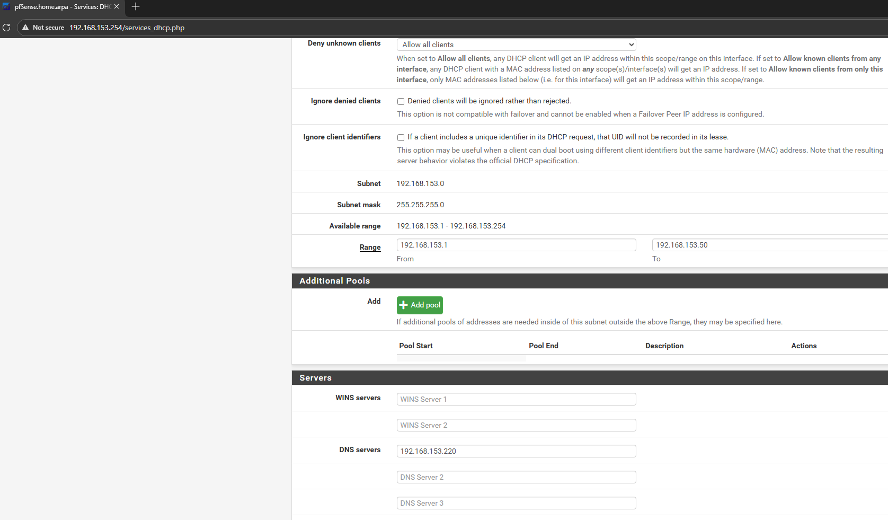

With the setup complete, on the client PC : 

system --> info --> Domein or workgroup --> (wijzigen/ configure) --> domain : nerdnest.test (domain name)

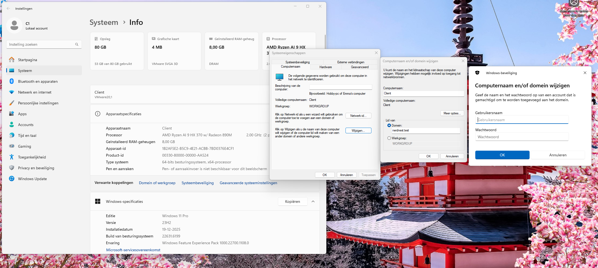 

If you are successful, you will get the notification below, and you must restart the client. 

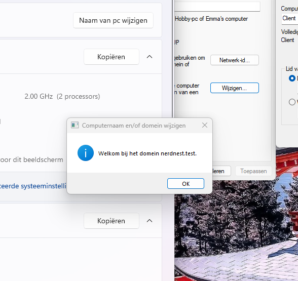 

# AD Structure 
